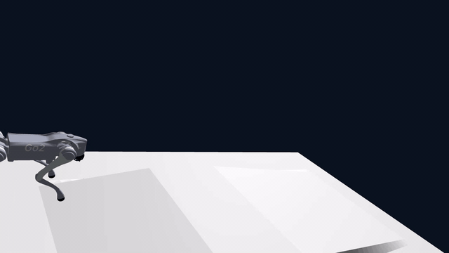

  

  

  

  # Go2 Multi-Speed Locomotion · Genesis + PPO

  > Unitree Go2 trained with PPO in Genesis | 10-scenario eval: **1 fall** |
  > action_std **0.30** | supports vx/vy/ωz full omnidirectional commands

  **No real hardware needed** — WSL2 compatible with built-in recorder.

  ## Why This Repo

  Training legged robots without real hardware is hard.
  This repo solves 3 common pain points:

  1. WSL2 rendering → built-in headless recorder
  2. Multi-speed instability → curriculum reward design
  3. Terrain curriculum → Genesis native subterrain API

  本项目是一个 Unitree Go2 强化学习训练与评估工程，核心目标是让策略在仿真中实现稳定行走、多速
  度全向运动，并在 Genesis 地形课程中完成斜坡通过任务。

  ## 1. 项目基于什么

  本项目主要基于以下技术栈：

  - Genesis: 物理仿真与并行环境执行。
  - rsl-rl (OnPolicyRunner + PPO): 策略训练框架。
  - PyTorch: 网络与优化器实现。
  - Go2 URDF: 机器人模型与关节定义。

  训练脚本采用统一结构：

  - 环境配置: env_cfg / obs_cfg / reward_cfg / command_cfg。
  - 训练配置: PPO 算法参数、Actor/Critic 网络结构、采样步数等。
  - 日志与模型: 保存到 logs/<exp_name>/。

  ## 2. 环境依赖

  - Python 3.10+
  - Genesis
  - rsl-rl-lib >= 5.0.0
  - PyTorch (CUDA)

  建议在 Linux 环境运行。

  ## 3. 普通训练 (normal train)

  普通训练入口是 go2_train.py，对应环境 go2_env.py。

  示例：

  ```bash
  python go2_train.py -e go2_v2 -B 4096 --max_iterations 5000 --seed 1

  参数说明：

  - -e: 实验名，对应 logs/<exp_name>/。
  - -B: 并行环境数 (num_envs)。
  - --max_iterations: 训练迭代数。

  ## 4. 多速度训练 (multivel)

  多速度训练入口是 go2_train_multivel.py，对应环境 go2_env_multivel.py。

  核心思想是把速度指令作为策略输入，并在训练中持续随机切换目标速度，让策略学习从“当前状态”跟
  踪“变化中的速度命令”。

  具体做法：

  1. 指令空间扩展为全向三维命令：

  - vx: 前进/后退
  - vy: 左右侧移
  - wz: 左右转向

  2. 环境定时重采样命令：

  - 每隔固定秒数随机采样新命令
  - 含小速度 dead-zone，鼓励策略学会真正“停住”而非微抖

  3. 观测中显式包含命令项：

  - 让策略同时感知机体状态和目标速度

  4. 奖励围绕“跟踪 + 稳定 + 平滑”：

  - tracking_lin_vel / tracking_ang_vel
  - 惩罚竖直速度、姿态抖动、动作变化率等

  5. 训练后用 demo 或交互脚本做行为验证：

  - 离线分段命令录像
  - 实时按键控制检查响应性

  基础训练示例：

  python go2_train_multivel.py -e go2-multivel --num_envs 4096 --max_iterations 5000 --seed 1

  可视化调试（小环境数）：

  python go2_train_multivel.py -e go2-multivel --num_envs 16 --max_iterations 300
  --show_viewer

  ## 5. 多速度结果

  | Metric | Value |
  |--------|-------|
  | Eval scenarios | 10 |
  | Falls | 1 (at 1.8 m/s) |
  | Mean action std | 0.30 |
  | Stillness reward | 0.00 |
  | Training time | ~2h (RTX 5060) |

  Scenarios tested: static stand, forward 1.8m/s, turn left/right, lateral move, backward
  1.5m/s, combined forward+turn, stop.

  ## 6. 斜坡课程与结果

  斜坡路线使用多速度 checkpoint 初始化，再在 Go2EnvDR 的 slope_track 地形上微调。评估目标不是
  单纯存活，而是从坡前平地起步，完成：

  flat start -> uphill -> top platform -> downhill / traverse completion

  当前推荐的斜坡 checkpoint：

  logs/go2-slope-from-multivel-height034-a2-stable/model_200.pt

  这是目前最适合展示和对照的斜坡策略。它来自 A2 stable 分支，目标速度为 0.30 m/s，训练坡度主要
  覆盖 0/3/5/8deg，后续用扩展评估验证到 10deg。

  斜坡评估结果：

  | Slope | Success | Fall | Timeout | Progress |
  |-------|---------|------|---------|----------|
  | 5deg | 1.00 | 0.00 | 0.00 | 4.80m |
  | 8deg | 1.00 | 0.00 | 0.00 | 4.80m |
  | 10deg | 1.00 | 0.00 | 0.00 | 4.80m |
  | 12deg | 0.00 | 0.38 | 0.62 | 0.95m |

  8deg README demo:

  gifs/slope_traverse_8deg_ckpt_200.gif

  10deg best video:

  results/slope_best_a2_10deg_video/go2-slope-from-multivel-height034-a2-stable/videos/
  slope_traverse_10deg_ckpt_200.mp4

  当前结论：

  - 5/8/10deg 已经稳定通过。
  - 12deg 还没有稳定解决，主要失败信号是 pitch 方向姿态失稳和无法完成穿越。
  - 降低 learning rate、关闭 entropy bonus、冻结 action std 后，action std / entropy 爆炸明显
    改善，但训练退化没有完全消失。后续 PPO 微调仍可能把已有斜坡 gait 打坏。
  - 当前最稳妥的展示 checkpoint 仍是 A2 model_200.pt。

  ## 7. 评估与演示

  离线录像评估：

  python go2_eval_multivel.py -e go2-multivel --ckpt 5000 --demo
  python go2_eval_multivel.py -e go2-multivel_morestable --ckpt 5000 --demo

  交互控制评估（支持方向键/WASD与录像）：

  python go2_eval_multivel_command.py -e go2-multivel_morestable --ckpt 5000 --live_keys
  --show_viewer
  python go2_eval_multivel_command.py -e go2-multivel_morestable --ckpt 5000 --live_keys
  --show_viewer --record

  斜坡评估入口：

  - go2_eval_slope_traverse.py

  斜坡环境、训练和评估相关文件：

  - go2_env_dr.py
  - go2_train_slope_curriculum.py
  - go2_eval_slope_traverse.py

  ## 8. 建议关注指标

  训练与对比时建议重点关注：

  - episode length
  - tracking_lin_vel / tracking_ang_vel
  - action_std 或动作方差
  - 评估中的摔倒次数与恢复能力
  - 斜坡 traverse success rate
  - roll_fall / pitch_fall
  - mean_progress_m

  ## 9. 备注

  - 若 checkpoint 体积较大，建议保留关键里程碑模型。
  - 本仓库已提供 LICENSE 与 requirements.txt，可直接用于开源发布与环境安装。
  - 当前台阶链路仍在整理中，不建议直接作为正式训练结果使用。
